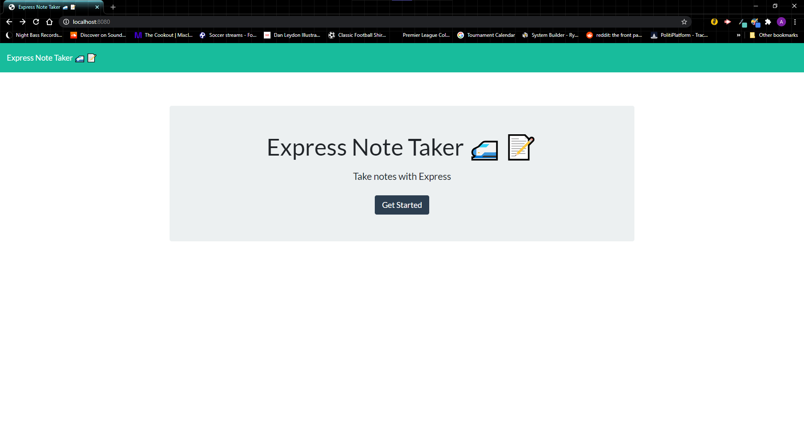
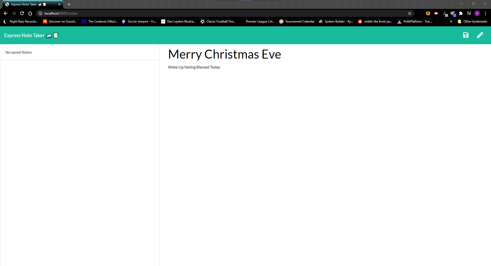
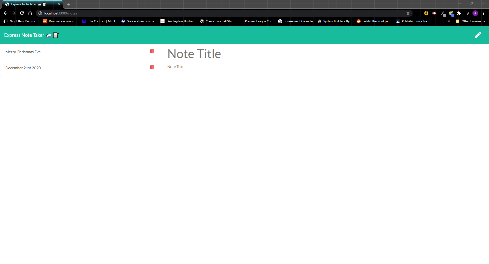
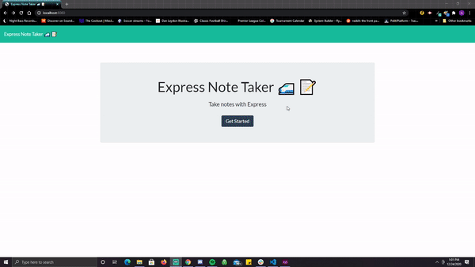

# Express Note Taker

## Table of Contents
1. [ Description ](#desc)
2. [ Installation ](#install)
3. [ Usage ](#usage)
4. [ License ](#lic)
5. [ Contributing ](#contrib)
6. [ Tests ](#test)
7. [ Questions ](#quest)
    

## 1. Description
This is a note-taking application that allows a user to write, save, access, and edit notes to and from a JSON file. The front end uses JavaScript and jQuery, and the back end uses Node.js and Express routing.

When the user opens the application and navigates to the note taking page, all saved notes that exist in the JSON file will be rendered as list items with the creation date. The user can then select any of these old notes, and they will appear in the main text area to be viewed or edited. This allows the user to add, delete, and save new copies of edited old notes. Alternatively, the user can select the pencil icon in order to write a brand new note. When any note is edited or created, the save button will appear, which allows the user to save the new note to the JSON file. The page automatically appends the newly saved notes to the JSON file and the user's list.

Since this application saves the notes to (and deletes notes from) the JSON.db file, there is no need for a relational or non-relational database to store the data. The application ensures that the JSON file is rewritten upon each addition to or deletion from the file in order to prevent duplicates. POST and DELETE routes ensure that the correct operations happen to the JSON file whether adding or deleting, respectively.
    

## 2. Installation
npm install, npm start, node server.js
    

## 3. Usage
You will be greated at the intro page when you first come to the site. Click the "Get Started" button to begin. Make sure your notes have both a Title and a body of text that represent your note. Once you have writen down all that you need to, click the "Save" icon. (Be aware that the "Save" icon will only appear once you have a Title and notes.) The note will then be saved to the left of the site showing the Title but not the body of text. You can retrieve the note by clicking on the title in the left pannel. Clicking the red trash can icon will remove the note from your list. To create a new note, click on the pencile icon.
    

## 4. License
MIT
    

## 5. Contributing
none
    

## 6. Tests

    

## 7. Questions
Please visit my GitHub to view all of my work:

https://www.github.com/CdmMandolorian 

Contact me at: egalindounited@gmail.com

## LIVE LINK: 
<a href="https://express-notetaker-1.herokuapp.com/">Express Note Taker</a>

## Screenshots of Express Note Taker:

## LIVE VIDEO GIF's OF Express Note Taker:

## Repository:  
[Express Note Taker](https://github.com/CdmMandalorian/ExpressNoteTaker)  

  
## Portfolio:  
[Armando Galindo Portfolio](https://cdmmandalorian.github.io/Armando-E-Galindo-Portfolio/)
  
## Credits:    
HTML 5  
CSS    
BootStrap      
Google Fonts API                
Javascript                   
Node         
Express Handlebars     